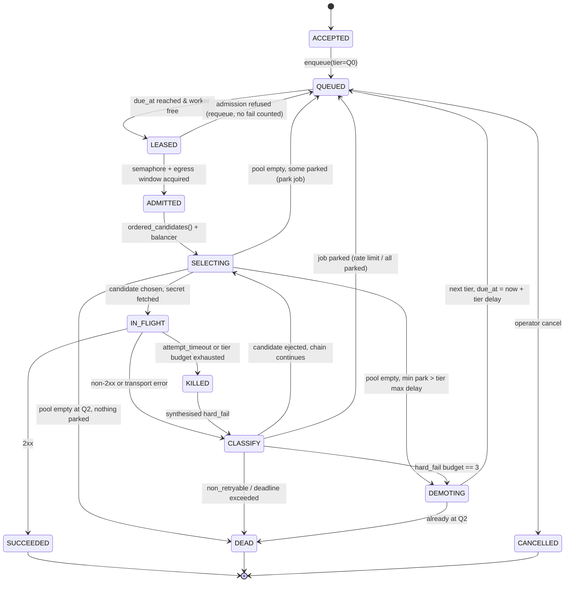

# Design — tiered queues, kill-and-send, and egress load balancing

> Status: **design only**. No code accompanies this document.
> Companion to [`AGENT_SPLIT.md`](AGENT_SPLIT.md) and [`CLAUDE_DECISIONS.md`](CLAUDE_DECISIONS.md).
> Gate: Claude reviews §10 before Cursor starts §9.

Scope: the egress path of the local LLM proxy — everything between
`POST /v1/chat/completions` and the upstream provider. The ingress token budget
(`vault/ratelimit.py`) is out of scope and stays exactly where it is.

**Composition rule for this whole document:** the queue layer owns *scheduling and
job identity*. It owns nothing else. Health, classification, ordering, concurrency
and pacing already exist in `route/` and `vault/` and are consumed, not replaced.
Any proposal below that duplicates an existing module is a bug in the design.

---

## 1. Problem statement — what breaks today

The current egress path is `app.py:1839 → vault/proxy.py:chat_completions`. It
computes `fallback.ordered_candidates()` once, walks the list, and returns 502 if
every hop fails. That is a *single synchronous pass with no time dimension*, and
seven distinct failures follow from it.

### 1.1 A rate limit permanently damages a healthy key

`proxy.py` calls `fallback.record_failure(record.id, err)` for **every** non-2xx
response (`vault/proxy.py:81`). `FallbackManager.record_failure` increments
`HopCircuit.failures` and opens the circuit at 3 (`vault/fallback.py:133`). So
three HTTP 429s — the provider politely saying "wait 20 seconds" — take a
perfectly good key out of the pool for 60 seconds.

This is the highest-severity bug in the current path, and it is already known to
be wrong elsewhere in the repo: `route/breaker.py:22` deliberately excludes 429
from `TRIP_STATUS_CODES` and the module docstring says so explicitly. The vault
layer never got the memo.

### 1.2 The retry hint the provider sends is thrown away

`route/fallback_signals.py` contains a complete `Retry-After` /
`X-RateLimit-Reset` / free-text parsing ladder (`parse_upstream_retry_hint_ms`)
and a classifier (`check_fallback_error`) that returns a `cooldown_ms`.
**`proxy.py` imports none of it.** A provider that says "retry after 30s" gets
retried after zero seconds, on a different key, and then never again.

### 1.3 There is no time dimension at all

The whole candidate chain is exhausted in milliseconds. A transient provider
blip — the exact thing 503 means — produces a hard 502 to the caller when a
two-second pause would have succeeded. There is no backoff, no second pass, and
no place to park work that would succeed later.

### 1.4 Non-retryable errors are retried against every key

A 400 for context overflow, or a malformed request body, marches down the entire
chain making the identical doomed call against every key, marking each one
failed on the way through. `check_fallback_error` already distinguishes
`context_overflow` and `non_retryable` — unused.

### 1.5 Two circuit-breaker layers that do not know about each other

| Layer | Scope | Counts | Consumed by |
|---|---|---|---|
| `vault/fallback.py::HopCircuit` | one vault key | *everything*, threshold 3, open 60s | `ordered_candidates()` |
| `route/breaker.py::CircuitBreaker` | one provider | only 408/5xx, profile thresholds, escalating reset | `sorters.py::_p2c_score` |

The proxy consults the first and never the second. The p2c sorter consults the
second and never the first. Neither is wrong; nothing reconciles them.

### 1.6 No egress load balancing — the primary key eats everything

`ordered_candidates()` sorts strictly by role band then `priority`
(`vault/fallback.py:113`). With three equal free-tier keys, key #1 receives 100%
of traffic until it rate-limits, while #2 and #3 sit idle. Meanwhile
`route/strategies.py` implements eight balancing strategies against a
`RouteTarget` registry that **is never populated from the vault** — `/api/route/targets`
is a parallel universe with no secrets and no connection to the request path.

Likewise `route/semaphore.py` (per-model concurrency with a bounded FIFO queue
and `mark_rate_limited`) and `route/window_limiter.py` are fully implemented and
entirely unwired. Concurrent requests therefore all hit the primary key at once
and trip it together.

### 1.7 Failure is invisible and unrecoverable

An exhausted chain returns `502 {"details": ["label: HTTP 500", ...]}`. No job
id, no history, no dead-letter, nothing to replay, nothing for the UI to render
beyond a string list. The user cannot tell "provider is down" from "your key is
wrong" from "you hit your quota, try in an hour".

### 1.8 What the tiers buy

A tiered queue adds the one thing missing: **a clock**. It lets the system say
"not now, later, and here is exactly when" instead of "no". Everything else in
this document exists to make that statement accurate.

---

## 2. Architecture

### 2.1 Tier ladder

```
                    ┌──────────────────────────────────────┐
   POST /v1/chat    │  ingress: TokenBudgetLimiter          │  unchanged
   ───────────────► │  (vault/ratelimit.py) reserve/settle  │
                    └───────────────┬──────────────────────┘
                                    │ Job created
                                    ▼
        ┌───────────────────────────────────────────────────────────┐
        │  Q0  HOT      no delay · attempt 60s · 3 hard fails        │
        │      walks the candidate chain immediately                 │
        └───────────┬───────────────────────────────┬───────────────┘
                    │ 3 hard fails → kill + send    │ success
                    ▼                               ▼
        ┌───────────────────────────────────────────────────────────┐
        │  Q1  RETRY    2s · 5s · 15s (equal jitter) · attempt 45s   │  DONE
        │      re-derives the candidate chain each attempt           │
        └───────────┬───────────────────────────────────────────────┘
                    │ 3 hard fails → kill + send
                    ▼
        ┌───────────────────────────────────────────────────────────┐
        │  Q2  COLD     60s · 300s · 900s · attempt 90s              │
        │      persisted; survives restart; async jobs only          │
        └───────────┬───────────────────────────────────────────────┘
                    │ 3 hard fails / deadline / no eligible keys
                    ▼
        ┌───────────────────────────────────────────────────────────┐
        │  Q3  DEAD     no attempts · persisted · manual replay      │
        └───────────────────────────────────────────────────────────┘
```

A job is in exactly one tier. Demotion is one-way; the only path back is an
explicit operator replay from Q3, which re-enters at Q0 as a **new job id**
linked by `replay_of`.

### 2.2 New modules (the only new code)

| Module | Owns | Must not contain |
|---|---|---|
| `route/attempt.py` | Two-axis outcome classification (§4). Pure functions. | Any I/O, any state |
| `route/tiers.py` | `TierConfig` defaults, delay computation, jitter | Any I/O |
| `route/queue.py` | `Job`, `TieredQueue`, due-time heap, tier transitions | HTTP, secrets |
| `route/dispatcher.py` | The attempt loop: lease → admit → select → send → classify | Health policy, ordering logic |
| `route/balancer.py` | `KeyRecord → RouteTarget` projection + band-scoped strategy | Secret access |
| `route/queue_store.py` | SQLite persistence for Q2/Q3 (§7) | Scheduling policy |
| `routers/queue.py` | HTTP + SSE surface (§8) | Anything above |

### 2.3 What each new module composes instead of reimplementing

| Concern | Existing module used | How |
|---|---|---|
| Which keys are eligible | `vault/fallback.py::FallbackManager.ordered_candidates()` | Called fresh on **every attempt**, never cached across delays |
| Per-key circuit | `vault/fallback.py::HopCircuit` | Extended with `park_until` (§4.4); `record_failure` called only for `hard_fail` |
| Per-provider circuit | `route/breaker.py::get_circuit_breaker(provider)` | Checked via `acquire_probe_slot()` before send; `record_failure(status=…)` after. Its own 429 exclusion already does the right thing |
| Error classification | `route/fallback_signals.py::check_fallback_error` | Wrapped by `attempt.py`, which maps its single verdict onto two axes |
| Retry-After parsing | `route/fallback_signals.py::parse_upstream_retry_hint_ms` | Sole source of upstream delay hints |
| Ordering within a band | `route/strategies.py::apply_strategy` | Called by `balancer.py` |
| Usage metrics | `route/types.py::ComboMetrics` + `registry.py::record_target_result` | Populated for real for the first time |
| Concurrency | `route/semaphore.py::acquire` | Admission control at dispatch (§3, ADMITTED) |
| Egress pacing per key | `route/window_limiter.py::SlidingWindowLimiter` | Keyed on `key_id`, optional per-key QPS cap |
| Secret access | `vault/store.py::KeyVault.get_secret` | Called by the dispatcher only, after selection, never by the balancer |
| Encryption at rest | `vault/crypto.py::Seal` | For persisted job payloads (§7.3) |
| Ingress budget | `vault/ratelimit.py::TokenBudgetLimiter` | Untouched. Reserve once at accept; settle once at terminal state, not per attempt |

`chat_completions` in `vault/proxy.py` becomes a thin adapter: build the request,
send it, return `(status, headers, body)`. All policy moves out of it.

### 2.4 Interaction with the existing two-circuit split

Keep both. They answer different questions and merging them loses information.
Precedence at selection time, cheapest check first:

1. `KeyRecord.enabled` and `lifecycle == "active"` — vault truth.
2. `HopCircuit` not open, and `park_until` elapsed — **key**-scoped.
3. Provider `CircuitBreaker.acquire_probe_slot()` — **provider**-scoped.
4. Per-key `SlidingWindowLimiter.try_acquire` — egress pacing.

A provider-open breaker skips every key for that provider without touching their
hop circuits, which is the correct blast radius for "OpenAI is down". A key-open
hop circuit skips one key and leaves siblings on the same provider alive, which
is correct for "this key is bad".

---

## 3. State machine for a request attempt

Job-level states are persisted; attempt-level states are transient.



### 3.1 Transition rules that are easy to get wrong

- **`LEASED → QUEUED` on admission refusal costs nothing.** A full semaphore or a
  closed egress window is backpressure, not failure. It must never increment a
  fail counter, or a busy laptop demotes healthy jobs to the cold queue.
- **`SELECTING` re-derives the chain every time.** After a 15-second Q1 delay the
  cached candidate list is stale — circuits may have half-opened, the precheck
  loop may have flipped a key. Never carry a candidate list across a delay.
- **`KILLED` is a real cancellation.** The in-flight `httpx` request is cancelled
  (task cancel / response close), not merely abandoned. See §10.4 for the
  duplicate-billing risk this creates.
- **Deadline is checked at three points** — on lease, before send, and after
  classify. A job whose deadline lands mid-delay must not sit in the heap until
  its due time to discover it is dead.
- **`SUCCEEDED` and `DEAD` both settle the ingress reservation exactly once.**

### 3.2 "Kill and send" — precise definition

The user's requirement, stated as an invariant:

> When a job accumulates **3 hard failures within one tier**, the dispatcher
> cancels any in-flight attempt for that job, stops walking the candidate chain,
> and enqueues the job into the next tier with `due_at = now + next_tier_delay(0)`.

Two clarifications, because the phrase is ambiguous:

- The counter is **per job, per tier**, and resets to zero on demotion. It is not
  a per-key counter — that is `HopCircuit`, which already exists.
- Only `hard_fail` increments it. See §4.

---

## 4. Failure counting rules

### 4.1 Why one verdict is not enough

`check_fallback_error` returns a single `FallbackDecision`. That is correct for
its original job — "should this *candidate* be abandoned?" — but the queue needs a
second answer: "what happens to the *job*?" These genuinely differ. A plain 401
currently classifies as `non_retryable` (it falls past every branch in
`fallback_signals.py:216` to the final return), which is right for the candidate
and catastrophically wrong for the job: one bad key would kill a request that the
next key would have served.

So `route/attempt.py` maps one input onto **two axes**:

**Axis A — candidate disposition:** `keep` · `park(ms)` · `eject_for_job` · `quarantine_key`
**Axis B — job disposition:** `continue_chain` · `park_job(ms)` · `demote` · `dead(reason)`

### 4.2 The table

`Budget` = does this increment the per-job-per-tier hard-fail counter (3 → demote)?

| Signal | Class | Axis A (candidate) | Axis B (job) | Budget | Provider breaker | Hop circuit |
|---|---|---|---|:---:|---|---|
| 408, 500, 502, 503, 504 | `hard_fail` | `keep` | `continue_chain` | **yes** | `record_failure(status)` | `failures += 1` |
| Connect / DNS / TLS error | `hard_fail` | `keep` | `continue_chain` | **yes** | `record_failure()` (no status ⇒ counts) | `failures += 1` |
| Read timeout | `hard_fail` | `keep` | `continue_chain` | **yes** | `record_failure()` | `failures += 1` |
| Attempt killed (timeout / budget) | `hard_fail` | `keep` | `demote` | **yes** | see §10.3 | see §10.3 |
| 429 with `Retry-After` | `rate_limit` | `park(hint)` | `continue_chain` | no | untouched | `park_until` only |
| 429 without hint | `rate_limit` | `park(5 000)` | `continue_chain` | no | untouched | `park_until` only |
| Rate-limit text, any status | `rate_limit` | `park(hint or 5 000)` | `continue_chain` | no | untouched | `park_until` only |
| 402 / `credits_exhausted` | `quota_exhausted` | `park(6 h)` + surface | `continue_chain` | no | untouched | `park_until`, UI flag |
| 401/403 + OAuth signals | `auth_stale` | `park(60 000)` | `continue_chain` | no | untouched | `park_until` |
| 401/403 generic | `auth_fail` | `quarantine_key` | `continue_chain` | no | untouched | `set_precheck(auth_fail)` |
| `account_deactivated` | `permanent` | `quarantine_key` | `continue_chain` | no | untouched | `set_precheck(auth_fail)` + UI alert |
| 400 + `context_overflow` | `context_overflow` | `eject_for_job` | `continue_chain` (larger-context candidates only) | no | untouched | untouched |
| 400 / 404 / 422 other | `non_retryable` | `keep` | `dead("non_retryable")` | no | untouched | untouched |
| 2xx | `success` | `keep` | terminal | reset | `record_success()` | `record_success()` |

Three properties worth naming explicitly:

- **Rate limits never damage a key.** They park it. This single row fixes §1.1 and
  aligns the vault layer with the stance `route/breaker.py` already took.
- **Auth failures never kill a job.** They shrink the pool. `_is_available` already
  excludes `precheck_status == "auth_fail"` (`vault/fallback.py:93`), so
  quarantine is one existing call.
- **`non_retryable` mutates no health state.** The request was wrong, not the key.

### 4.3 When every candidate is parked

This is distinct from failure and must not be treated as one.

```
if pool is empty and any candidate is parked:
    wake = min(park_until for parked candidates)
    if wake - now <= tier.max_delay:  park job until wake      # stay in tier
    else:                             demote, due_at = wake     # longer queue
```

That second branch is the literal mechanism the user asked for — *"move to another
queue that delays longer"* — and it triggers on the honest signal (the provider's
own reset time exceeding what this tier is willing to wait), not on a fail count.

If `wake > job.deadline`, the job is `DEAD("retry_after_exceeds_deadline")` with
the wake time reported, so the UI can say "your quota resets at 14:32" instead of
"failed".

### 4.4 Required change to `HopCircuit`

```python
@dataclass
class HopCircuit:
    key_id: str
    state: CircuitState = "closed"
    failures: int = 0
    opened_at: float | None = None
    last_error: str | None = None
    park_until: float | None = None      # new
    park_reason: str | None = None       # new
```

`_is_available` gains one clause: parked keys are unavailable until `park_until`.
New method `record_park(key_id, cooldown_ms, reason)` sets it **without touching
`failures`**. This is additive; `FallbackStatus.status()` gains two fields and no
existing caller breaks.

---

## 5. Delay schedule

### 5.1 Defaults

| Tier | Attempt delays | Attempt timeout | Hard-fail budget | Tier wall clock | Max single delay | Persisted |
|---|---|---|---|---|---|---|
| **Q0 hot** | `0s` (immediate chain walk) | 60 s | 3 | 90 s | 0 s | no |
| **Q1 retry** | `2s · 5s · 15s` | 45 s | 3 | 120 s | 30 s | no |
| **Q2 cold** | `60s · 300s · 900s` | 90 s | 3 | 30 min | 900 s | **yes** |
| **Q3 dead** | — | — | — | 7 days retention, 500 jobs | — | **yes** |

Worst case from accept to dead-letter: ≈ 90 s + 120 s + 21 min ≈ **24 minutes**.

Q0's 60 s attempt timeout matches today's `timeout_s=60.0` default in
`vault/proxy.py:22`, so the hot path's latency envelope is unchanged.

### 5.2 Jitter

Equal jitter, not full jitter: `actual = d/2 + U(0, d/2)`.

Full jitter (`U(0, d)`) is the textbook answer for a fleet of clients avoiding a
thundering herd. There is no fleet here — one desktop, a handful of concurrent
requests — so full jitter mostly just adds unpredictable latency. Equal jitter
keeps a floor under the wait while still de-correlating concurrent jobs.

Q0 has no delay and therefore no jitter.

### 5.3 Upstream hints override the schedule

```
scheduled = tier.delays[attempt_index]
hint      = parse_upstream_retry_hint_ms(headers, error_text)   # existing ladder
effective = max(jitter(scheduled), hint or 0)

if effective <= tier.max_delay:   stay in tier, due_at = now + effective
elif not at Q2:                   demote, due_at = now + effective
elif effective <= remaining_deadline: stay at Q2, due_at = now + effective
else:                             DEAD("retry_after_exceeds_deadline", wake_at)
```

The provider is the authority on when to come back. The schedule is only a
fallback for providers that do not say.

### 5.4 Deadlines

| Job kind | Header | Default deadline | Highest tier reachable |
|---|---|---|---|
| Interactive (sync HTTP) | none | 90 s | **Q1** |
| Detached | `X-OpenVault-Queue: async` | 24 h | Q2 |
| Explicit | `X-OpenVault-Deadline-Ms: N` | N (clamped 1 s – 24 h) | derived from N |

An interactive request cannot benefit from a 15-minute cold queue — the socket is
gone. Sync callers get their 504 at the Q1 boundary. Whether the job should keep
running after the caller disconnects is §10.1 and is Claude's call.

### 5.5 Everything above is configuration

Persist to `~/.openvault/queue.json` next to the existing `fallback.json`, loaded
the same way `FallbackConfig` is (`vault/fallback.py:57`), with the table in §5.1
as the built-in default. Add `queue_path()` to `paths.py`.

---

## 6. Load balancer placement

### 6.1 Placement: after eligibility, before secret fetch

```
FallbackManager.ordered_candidates()      # health + role + priority  (existing)
        │  list[KeyRecord], already filtered
        ▼
balancer.project()                        # KeyRecord → RouteTarget   (new, no secrets)
        │
        ▼
balancer.order()                          # apply_strategy WITHIN each role band
        │  role bands preserved end-to-end
        ▼
dispatcher                                # KeyVault.get_secret(head.key_id)
```

Three reasons this is the right seam, in order of weight:

1. **Secret custody stays narrow.** The balancer never sees plaintext. Given the
   repo's posture in `SECRETS_CUSTODY.md`, a new module that handles ordering has
   no business handling keys.
2. **Role intent survives.** Balancing *across* bands would let a `free` key serve
   a request the user marked `primary`. The balancer reorders **within** a band
   and never across one. `role_order` remains the outer sort.
3. **The metrics it needs live at this layer.** `ComboMetrics` is keyed on
   `execution_key`, and breaker state is keyed on provider. Both are available
   here; neither is available inside `KeyVault`.

### 6.2 The projection

```python
RouteTarget(
    execution_key=f"{record.provider}:{record.id}",   # sibling keys stay distinct
    provider=record.provider,
    model_str=body["model"],
    connection_id=record.account_id,
    weight=1.0,                # until a per-key weight field exists
    priority=record.priority,
    cost=None,                 # no price table exists — see below
)
```

This finally populates the `RouteTarget` registry from real data and makes
`/api/route/metrics` mean something.

### 6.3 Strategy options

| Strategy | Behaviour | Fit for OpenVault | Verdict |
|---|---|---|---|
| `priority` | Vault order | Today's behaviour; zero spread | Keep for the `primary` band |
| `fill-first` | Same as priority | Saturate one key before the next | Only if a key has a genuinely free tier worth exhausting first |
| `round-robin` | Deck shuffle, no replacement (`rr_state.py`) | Perfect spread, ignores health | Good fallback |
| `weighted` | Roulette by weight | Needs a weight field users must tune | Offer, do not default |
| `p2c` | Two random, better score wins; already breaker-aware (`sorters.py:30`) | Designed for stale distributed state. With 2–5 local keys and exact local metrics, it degenerates toward random | Not the default |
| `least-used` | Fewest requests first | Exact, deterministic, spreads quota, one-line explanation to a user | **Recommended default** |
| `random` | Fisher–Yates | Spread without state | Debug only |
| `cost-optimized` | Cheapest first | `cost` is always `None` — **would silently sort by nothing** | Hide until a price table exists |

### 6.4 Recommended default

> **`role_order` bands (unchanged) → `least-used` within each band, except the
> `primary` band which stays `priority`.**

Rationale: with a handful of keys and perfect local metrics, the distributed-systems
justification for p2c does not apply, and `least-used` is the only strategy a user
can verify by eye ("it used the one with fewer requests"). Keeping `primary` on
`priority` preserves the meaning of the word "primary" — see §10.7.

### 6.5 Two additions the balancer needs

- **Parked keys sort last, not out.** A key parked for 3 s should still be picked
  over nothing at all if the alternative is failing the job. Extend the sort key
  with `park_until`, do not filter on it.
- **Quota-aware pacing.** `TargetMetrics.requests` counts requests, not tokens or
  quota. A per-key `SlidingWindowLimiter` (`window_limiter.py`, already written)
  keyed on `key_id` gives a real egress cap. Optional per key, off by default.

---

## 7. Persistence

### 7.1 Recommendation — split by tier

> **Q0 + Q1 in memory. Q2 + Q3 in SQLite at `~/.openvault/queue.db` (WAL). No Redis.**

Pay for durability only where it buys something.

### 7.2 Why

| Option | Verdict |
|---|---|
| **All in-memory** | Free and simple, and correct for Q0/Q1 — a job with a 90-second horizon has nothing to gain from surviving a restart. But Q2's entire value proposition is *surviving 15 minutes*, and OpenVault ships inside Electron (`apps/shell/electron/`) where a restart in that window is ordinary. Losing the cold queue on restart makes the cold queue pointless. |
| **SQLite** | The repo already does exactly this: `vault/store.py` opens `~/.openvault/keys.db` with `sqlite3` from the stdlib, `paths.py` centralises locations, and `crypto.Seal` is available for at-rest encryption. Zero new dependencies, zero new processes, survives restart, queryable for the DLQ UI. Single-writer is a non-constraint for a single-user desktop app. **Recommended.** |
| **Redis** | Already optional in-repo (`vault/redis_store.py`, `try_make_redis_store()` at `app.py:583`) for the ingress limiter, and it degrades gracefully to in-memory when absent. Making the *queue* require Redis would break the local-first, no-servers model that the product is built on. Keep it as an opt-in backend behind the same `QueueStore` protocol shape that `BucketStore` already models (`ratelimit.py:126`), for a future multi-node case. **Not now.** |

### 7.3 Schema sketch

```sql
CREATE TABLE IF NOT EXISTS jobs (
  id            TEXT PRIMARY KEY,
  tier          INTEGER NOT NULL,          -- 2 = cold, 3 = dead
  state         TEXT    NOT NULL,          -- QUEUED | DEAD | CANCELLED | SUCCEEDED
  due_at        REAL    NOT NULL,
  deadline_at   REAL    NOT NULL,
  attempt_index INTEGER NOT NULL DEFAULT 0,
  hard_fails    INTEGER NOT NULL DEFAULT 0,
  model         TEXT    NOT NULL,
  payload_blob  BLOB    NOT NULL,          -- Seal-encrypted request body
  last_reason   TEXT,
  last_key_id   TEXT,
  wake_hint_at  REAL,
  replay_of     TEXT,
  created_at    REAL    NOT NULL,
  updated_at    REAL    NOT NULL
);
CREATE INDEX IF NOT EXISTS jobs_due  ON jobs(tier, state, due_at);

CREATE TABLE IF NOT EXISTS attempts (
  job_id     TEXT NOT NULL,
  seq        INTEGER NOT NULL,
  tier       INTEGER NOT NULL,
  key_id     TEXT,
  provider   TEXT,
  status     INTEGER,
  class      TEXT NOT NULL,               -- hard_fail | rate_limit | …
  latency_ms REAL,
  reason     TEXT,
  at         REAL NOT NULL,
  PRIMARY KEY (job_id, seq)
);
```

`payload_blob` holds the prompt, which is user content and at least as sensitive
as an API key. Encrypt it with the existing `Seal` — the master key is already
loaded. `attempts` stores no bodies, only classifications, so the DLQ view can
explain a failure without decrypting anything.

Hot path stays a `heapq` keyed on `due_at`; SQLite is write-through for Q2/Q3 and
is read once at startup to rehydrate. Retention sweep on the same
`threading.Timer` pattern `breaker.py:287` already uses.

---

## 8. API surface sketch

New router `routers/queue.py`, mounted the way `route.py` and `sentinel.py` are.

### 8.1 Existing endpoint, unchanged contract

`POST /v1/chat/completions` keeps its shape. New optional request headers:

| Header | Values | Effect |
|---|---|---|
| `X-OpenVault-Queue` | `sync` (default) · `async` | `async` returns `202 {job_id}` immediately and permits Q2 |
| `X-OpenVault-Deadline-Ms` | integer | Overrides the default deadline, clamped 1 s – 24 h |

New response headers on the sync path: `X-OpenVault-Job-Id`,
`X-OpenVault-Attempts`, `X-OpenVault-Tier`, `X-OpenVault-Key-Id`.

When a sync job exhausts Q1, return **504** with `wake_at` and `job_id` when the
job continues in Q2, rather than today's undifferentiated 502.

### 8.2 Queue endpoints

| Method | Path | Purpose |
|---|---|---|
| `POST` | `/api/queue/jobs` | Enqueue detached job → `202 {job_id, tier, due_at}` |
| `GET` | `/api/queue/jobs` | List; filters `tier`, `state`, `limit` |
| `GET` | `/api/queue/jobs/{id}` | Job + full attempt history |
| `POST` | `/api/queue/jobs/{id}/cancel` | Cancel queued or in-flight |
| `POST` | `/api/queue/jobs/{id}/replay` | Q3 → new job at Q0, links `replay_of` |
| `GET` | `/api/queue/stats` | Per-tier depth, in-flight, next due, hard-fail rate |
| `GET` | `/api/queue/config` · `PUT` | Read/patch §5.1 tier config |
| `POST` | `/api/queue/pause` · `/resume` | Stop leasing without losing jobs |
| `GET` | `/api/queue/events` | SSE stream (below) |

Extensions to existing endpoints: `/api/route/metrics` gains `parkedUntil` and
`lastClass` per execution key; `/api/vault/fallback` status gains `park_until`
and `park_reason` per hop.

### 8.3 SSE events

`apps/web/src/lib/sse/` already has a client, frame parser and `useSSEStream`
hook, so the UI cost here is low. Event names and payloads:

| Event | Payload |
|---|---|
| `job.enqueued` | `job_id, tier, due_at, model` |
| `job.attempt_started` | `job_id, seq, tier, key_id, provider` |
| `job.attempt_failed` | `job_id, seq, class, status, reason, budget_used` |
| `job.candidate_parked` | `job_id, key_id, park_until, reason` |
| `job.killed` | `job_id, cause: "attempt_timeout" \| "tier_budget"` |
| `job.demoted` | `job_id, from_tier, to_tier, due_at, cause` |
| `job.succeeded` | `job_id, key_id, attempts, total_ms` |
| `job.dead` | `job_id, reason, wake_at?` |
| `tier.depth` | `{q0, q1, q2, q3}, in_flight` — throttled to 1 Hz |

`job.demoted` and `job.candidate_parked` are what let the UI say *"OpenAI is rate
limited until 14:32, moved to the slow queue, next try in 5 minutes"* — the
statement §1.7 says is impossible today.

---

## 9. What Cursor implements first

**Slice 1 — the classifier and park semantics. No queue, no new endpoint.**

This is the smallest change that fixes the highest-severity live bug (§1.1: rate
limits destroying healthy keys), and it produces the exact policy object every
later slice consumes, so none of it is rework.

### Files

| File | Change |
|---|---|
| `OpenMW/openmw/openvault/route/attempt.py` | **New.** `AttemptClass` literal, `CandidateAction`, `JobAction`, `AttemptOutcome` dataclass, and `classify_attempt(status, error_text, headers) -> AttemptOutcome` implementing the §4.2 table by wrapping `check_fallback_error`. Pure, no I/O, fully typed. |
| `OpenMW/openmw/openvault/vault/fallback.py` | Add `park_until` / `park_reason` to `HopCircuit`; add `record_park(key_id, cooldown_ms, reason)` that does **not** touch `failures`; honour `park_until` in `_is_available`; expose both in `status()`. Additive only. |
| `OpenMW/openmw/openvault/vault/proxy.py` | Replace the blanket `record_failure` at line 81 with `classify_attempt`. `hard_fail` → `record_failure` + provider `record_failure(status)`. `rate_limit` / `auth_stale` → `record_park`. `auth_fail` / `permanent` → `set_precheck(auth_fail)`. `non_retryable` → return immediately, no health mutation. Check `acquire_probe_slot()` before each send. Return the winning `key_id` and attempt log alongside the payload. |
| `OpenMW/openmw/openvault/route/__init__.py` | Export the new symbols, matching existing style. |
| `OpenMW/tests/test_attempt_policy.py` | **New.** |

### Proof to paste

1. Three consecutive 429s against one key: hop circuit stays `closed`,
   `failures == 0`, `park_until ≈ now + 5s`, chain moved on. *(Today: circuit
   opens for 60 s — the §1.1 bug, pinned as a regression test.)*
2. `429` + `Retry-After: 30` → `park_until ≈ now + 30s`, sourced from
   `parse_upstream_retry_hint_ms`, not a constant.
3. Three consecutive `503`s → hop circuit `open`, **and** the provider
   `CircuitBreaker` for that provider records failures.
4. `400` with `"input is too long"` → returns immediately; **no** key has
   `failures` or `park_until` mutated; response names the reason.
5. Generic `401` → that key is quarantined via `set_precheck(auth_fail)` and the
   **next candidate is still tried** (proves the two-axis mapping; a naïve reading
   of `check_fallback_error` would have killed the request).
6. `uv run pytest` — full suite green, especially `test_route_breaker.py`,
   `test_route_strategies.py`, `test_openvault.py`, `test_ratelimit.py`.
7. `uv run mypy --strict` clean on `route/attempt.py`.

### Then, in order — one slice per task card, each independently shippable

2. **In-memory Q0 + Q1** (`route/tiers.py`, `route/queue.py`, `route/dispatcher.py`)
   with kill-and-send at 3 hard fails, sync path only. Deterministic tests via an
   injected clock, the pattern `test_route_breaker.py::_Clock` already uses.
3. **Balancer** (`route/balancer.py`): projection + `least-used` within band.
   Proof: three equal free keys, thirty requests, spread within ±1.
4. **SQLite Q2/Q3** (`route/queue_store.py`) + `routers/queue.py` + SSE.
5. **UI**: queue depth, cold-queue countdown, DLQ list with replay.

---

## 10. What Claude must decide

Ordered by how much rework a late answer causes.

### 10.1 Does a detached job outlive its caller? *(blocks slice 2)*
The cold queue only makes sense for work nobody is waiting on. Accepting
`X-OpenVault-Queue: async` means OpenVault runs LLM calls on the user's behalf
with no window open. That is a different product than "a proxy". If the answer is
no, Q2 shrinks to a longer Q1 and §5.4 collapses. **Everything downstream depends
on this.**

### 10.2 May the cold queue spend money hours later? *(product ethics)*
A job demoted to Q2 can retry a paid key 21 minutes after the user walked away,
against a prompt they may have since abandoned. Options: restrict Q2 to
`free`/`cheap` roles; cap cold-tier spend; require explicit per-request opt-in.
Given the repo's honesty posture, silent deferred spending is the wrong default —
but the specific rule is a product call.

### 10.3 Does a killed attempt damage the key? *(correctness risk)*
§4.2 marks `attempt killed` as `hard_fail`. But a local Ollama on a loaded laptop
legitimately takes 90 s, and a 60 s attempt timeout would mark it bad and drain
it out of the pool — the framework punishing the user's own hardware. Options:
per-`BreakerProfile` timeouts (`local` already exists as a profile in
`breaker.py:56`), or count kills against the job only and never the key.
**Recommendation: count against the job, not the key.** Needs sign-off.

### 10.4 Duplicate delivery. *(cannot be engineered away here)*
A cancelled attempt may already have been billed and completed upstream. For chat
completions that is wasted money; for anything with side effects it is a
correctness bug. There is no idempotency key in the OpenAI chat API. Decide the
stance: accept and document, or refuse to kill attempts that have begun streaming
a response.

### 10.5 Encrypt persisted prompts, and for how long? *(security)*
§7.3 proposes `Seal` on `payload_blob` and 7-day DLQ retention. Confirm both.
Note the consequence: an encrypted payload is unreadable after a master-key
rotation, so a DLQ replay across a rotation silently fails. Acceptable?

### 10.6 Keep the two circuit layers separate? *(architecture)*
§2.4 recommends keeping key-scoped `HopCircuit` and provider-scoped
`CircuitBreaker` distinct with an explicit precedence order. The alternative —
one unified breaker registry — is less code but loses the ability to express "the
provider is down" separately from "this one key is bad". Sign off or redirect
before slice 2 wires both.

### 10.7 Default strategy, and may `primary` be balanced? *(product)*
§6.4 recommends `least-used` within band and `priority` for `primary`. If a user
has two primary keys, should traffic split? Arguments both ways: splitting doubles
effective quota; not splitting keeps "primary" meaningful and predictable.

### 10.8 Is the DLQ user-facing? *(scope)*
A visible dead-letter list with a Replay button is powerful and also the kind of
surface that turns "one button where one job exists" into an ops console. Debug
view behind a flag, or a first-class page?

### 10.9 Cross-check against OmniRoute before building
`AGENT_SPLIT.md` item 8 already assigns Claude the OmniRoute feature matrix. The
tier ladder here overlaps whatever `combo.ts` cascade logic was going to be
ported. Reconcile once, not twice.

---

## 11. Non-goals

Explicitly out of scope. Each is a real thing someone will ask for; each is a
different project.

1. **Distributed or multi-node queueing.** Single desktop, single writer. The
   `QueueStore` protocol leaves room for Redis; nothing else assumes it.
2. **Exactly-once delivery.** Not achievable against an API with no idempotency
   key. At-most-one-*successful*-attempt-per-job is the guarantee; duplicates on
   kill are possible (§10.4).
3. **Streaming.** `app.py:1812` rejects `stream: true` today. Mid-stream retry
   requires resumable generation and is a separate design.
4. **Provider shape translation.** `proxy.py:51` skips Anthropic because the API
   shape differs. The queue does not fix that; it will faithfully retry a request
   the adapter cannot build.
5. **Replacing `FallbackManager` or either circuit breaker.** Compose, extend
   additively, never fork.
6. **Replacing the ingress `TokenBudgetLimiter`.** Different axis (per-caller
   budget vs per-key egress health). Both stay.
7. **Priority classes / fair-share across users.** Single user. FIFO within a
   tier, ordered by `due_at`.
8. **Cost-based routing.** `cost` is `None` everywhere; there is no price table.
   `cost-optimized` stays hidden rather than sorting by nothing (§6.3).
9. **A results store.** Successful responses return to the caller or, for detached
   jobs, are held only until fetched. This is not a conversation database.
10. **OS-level background service.** The dispatcher lives in the FastAPI process.
    No daemon, no scheduled task, no autostart.
11. **Retrying tool calls or anything with side effects.** Chat completions only
    until §10.4 is answered.
12. **Auto-tuning delays from observed provider behaviour.** Static config with
    upstream-hint override (§5.3). Learned backoff is a later, separate idea.
```
