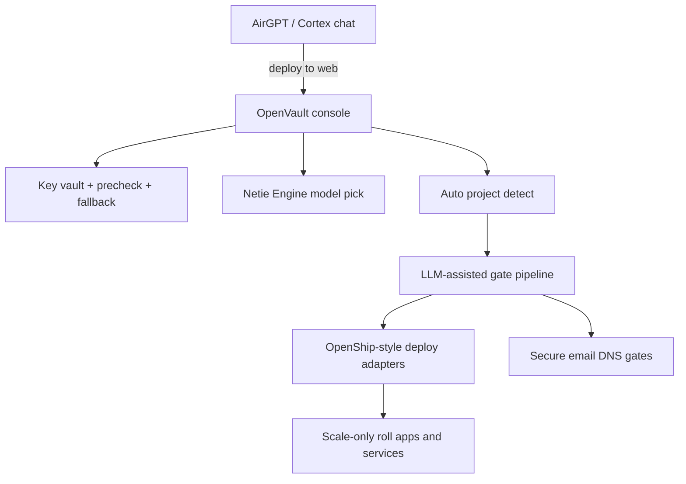

# OpenVault scale merge — Cortex × OmniRoute × OpenShip

> Honest map of what is absorbed vs what is still a gate pipeline.
> Product rule: **Cortex/AirGPT says “deploy to web” → OpenVault opens, auto-detects, runs gates, then scale-deploys.**

## Role of each system (merged uses)



| System | What we take | What OpenVault owns |
|--------|--------------|---------------------|
| **OpenVault** (this repo) | Keys, continuous precheck, fallback, health, model assign, **deploy orchestrator** | Local secure hub + gate runner |
| **Cortex / AirGPT** | Intent (“deploy to web”), engines, finished work packs | Calls `POST /api/deploy/from-cortex`; OpenVault auto-opens |
| **OmniRoute patterns** | Multi-key stability, precheck, fallback, best-model select | Already in OpenVault `/v1` + Engine tab |
| **OpenShip patterns** | Subdomain→SSL, build/roll, mail (SPF/DKIM/DMARC), apps+services install/update | **Adapters + gates** — not a full OpenShip fork |

## Target user flow

1. Finish work in Cortex / AirGPT.
2. Say **deploy to web**.
3. Cortex posts deploy intent to OpenVault (or opens `http://127.0.0.1:5000/#deploy`).
4. OpenVault **auto-detects** stack (Dockerfile / Node / Python / Go / static) — no manual “pick my type” like vanilla OpenShip UX.
5. LLM-assisted **gate checklist** must pass:
   - Keys healthy (precheck pool ready)
   - Cortex online (optional but recommended)
   - Subdomain + TLS plan
   - Secure email DNS (SPF / DKIM / DMARC / PTR checklist)
   - Build / rebuild
   - Playwright smoke (MCP when available; stub gate when not)
   - Bug/roll gates
6. **Scale-only deploy**: install or update apps + services (compose/systemd/OpenShip CLI when configured).

## Status (truth)

| Capability | Status |
|------------|--------|
| Key vault + continuous precheck + fallback | **Shipped** |
| Cortex engine/model catalog + selection | **Shipped** |
| Hardware health / bottleneck | **Shipped** |
| Auto project detect | **This slice** |
| Deploy gate pipeline + Cortex handoff API | **This slice** |
| Email DNS checklist gates | **This slice** (checks / plans — not a full mail server) |
| Live OpenShip CLI / Docker deploy executor | **Adapter stub** — wires when `OPENSHIP_URL` or local `openship` CLI exists |
| Playwright MCP fail→debug loop | **Gate stub** — MCP not in this environment; records fail artifact path |
| Slurm / K8s server orchestration | Deferred |
| Full OmniRoute 250-provider clone | Deferred (patterns only) |

## Cortex / AirGPT contract

```http
POST /api/deploy/from-cortex
Content-Type: application/json

{
  "project_path": "/path/to/app",
  "subdomain": "app.example.com",
  "intent": "deploy_to_web",
  "source": "airgpt",
  "open_console": true
}
```

Response includes `deploy_id`, auto-detect result, and ordered gates with `pass|fail|pending|skipped`.

## OpenShip adapter env

| Env | Meaning |
|-----|---------|
| `OPENSHIP_URL` | Remote OpenShip control plane API |
| `OPENSHIP_CLI` | Path/name of local `openship` binary |
| `OPENVAULT_DEPLOY_ROOT` | Default project root for detect |

## Non-goals for this slice

- Vendoring the entire OpenShip monorepo
- Running a production SMTP stack inside OpenVault
- Claiming Playwright MCP is installed when it is not
