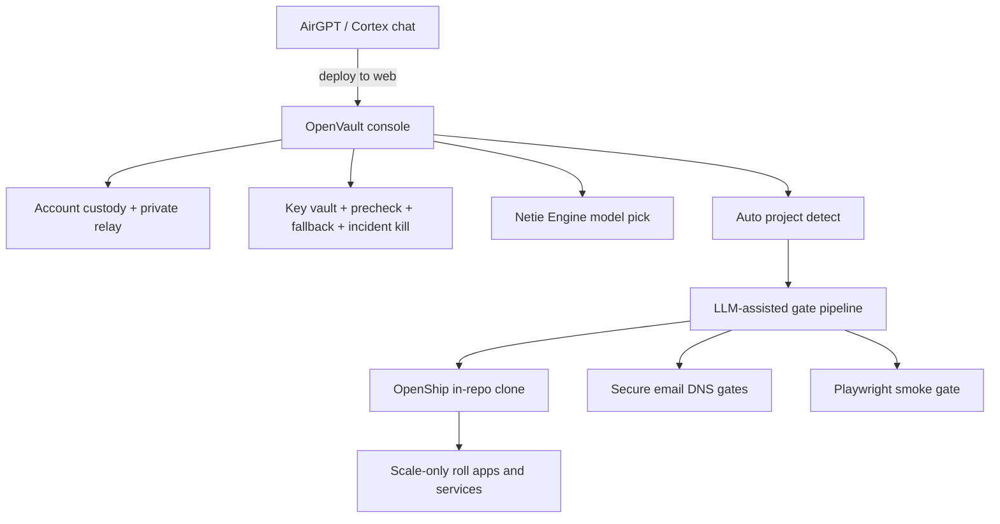

# OpenVault scale merge — Cortex × OmniRoute × OpenShip

> Honest map of what is absorbed vs what is still a gate pipeline.
> Product rule: **Cortex/AirGPT says “deploy to web” → OpenVault opens, auto-detects, runs gates, then scale-deploys.**

## Role of each system (merged uses)



| System | What we take | What OpenVault owns |
|--------|--------------|---------------------|
| **OpenVault** (this repo) | Keys, custody, continuous precheck, fallback, health, model assign, **deploy orchestrator** | Local secure hub + gate runner |
| **Cortex / AirGPT** | Intent (“deploy to web”), engines, finished work packs | Calls `POST /api/deploy/from-cortex`; OpenVault auto-opens |
| **OmniRoute patterns** | Multi-key stability, precheck, fallback, best-model select | Already in OpenVault `/v1` + Engine tab |
| **OpenShip patterns** | Subdomain→TLS, build/roll, mail (SPF/DKIM/DMARC), apps+services install/update | **In-repo OpenShip clone** (`openship.py`) + CLI/API adapters |
| **Account custody** | Netie email / Google / external email + private relay | Operator create/save/kill/replace keys |

## Target user flow

1. Tenant signs up — **prefer new Netie email**; Google/external also accepted; private relay allocated.
2. Operator (or self-serve) creates provider keys under that account; OpenVault stores them encrypted.
3. Finish work in Cortex / AirGPT → say **deploy to web**.
4. OpenVault auto-detects stack and runs gates (keys, subdomain, mail, build, Playwright, OpenShip, roll).
5. Playwright smoke writes an artifact under `~/.openvault/playwright-smoke/`.
6. OpenShip executor installs/updates apps+services (`OPENSHIP_MODE=simulate` locally, or real CLI/API).
7. If keys are hacked/manipulated → **incident kill** spins off: revoke all, mint replacements or list `needs_register`.

## Status (truth)

| Capability | Status |
|------------|--------|
| Key vault + continuous precheck + fallback | **Shipped** |
| Account custody + Netie email + private relay | **Shipped** |
| Incident kill / rotate / replace cloud keys | **Shipped** |
| Cortex engine/model catalog + selection | **Shipped** |
| Hardware health / bottleneck | **Shipped** |
| Auto project detect | **Shipped** |
| Deploy gate pipeline + Cortex handoff API | **Shipped** |
| Email DNS checklist gates | **Shipped** (checks / plans — not a full mail server) |
| OpenShip in-repo clone (plan + execute) | **Shipped** — simulate / CLI / API modes |
| Playwright smoke gate + artifacts | **Shipped** — dry/httpx or real Playwright when installed |
| Slurm / K8s server orchestration | Deferred |
| Full OmniRoute 250-provider clone | Deferred (patterns only) |
| Live Google OAuth handshake | Deferred (provider recorded; email supplied) |

## Cortex / AirGPT contract

```http
POST /api/deploy/from-cortex
Content-Type: application/json

{
  "project_path": "/path/to/app",
  "subdomain": "app.example.com",
  "intent": "deploy_to_web",
  "source": "airgpt",
  "open_console": true,
  "smoke_url": "https://app.example.com",
  "run_smoke": false
}
```

Follow-ups:

- `POST /api/deploy/{id}/playwright-smoke`
- `POST /api/deploy/{id}/execute` (OpenShip roll)
- `POST /api/openship/plan` with `execute: true`

## OpenShip adapter env

| Env | Meaning |
|-----|---------|
| `OPENSHIP_URL` | Remote OpenShip control plane API |
| `OPENSHIP_CLI` | Path/name of local `openship` binary |
| `OPENSHIP_MODE` | `auto` \| `simulate` \| `cli` \| `api` |
| `OPENVAULT_DEPLOY_ROOT` | Default project root for detect |
| `OPENVAULT_PLAYWRIGHT_MODE` | `auto` \| `playwright` \| `dry` |

## Non-goals (still)

- Vendoring an external OpenShip git monorepo (we ship an in-repo full surface clone instead)
- Running a production SMTP stack inside OpenVault
- Claiming Playwright browsers are installed when they are not (`dry` mode is honest)
