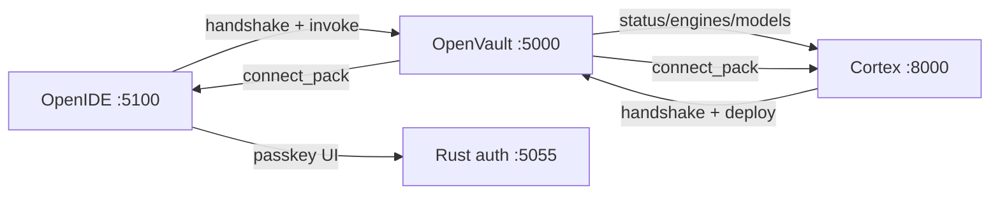

# OpenVault local mesh — Cortex × OpenIDE

## Roles

| Peer | Port | Role |
|------|------|------|
| **OpenVault** | 5000 | Keys, custody, `/v1`, deploy gates, mesh authority |
| **Cortex** | 8000 | Netie Engine — models, agents, deploy intent |
| **OpenIDE** | 5100 | Editor bridge — sign-in/passkey invoke, uses vault `/v1` |
| **Rust console** | 5055 | Passkey auth UI + sealed password vault |

All bind **127.0.0.1** only for the perfect local path.

## APIs

| Route | Purpose |
|-------|---------|
| `GET /api/local/mesh` | Probe peers + connect pack |
| `PUT /api/local/mesh/config` | Set Cortex/OpenIDE/Rust URLs |
| `POST /api/local/handshake` | Peer announce (auto-approve loopback) |
| `POST /api/local/handshake/{id}/decide` | Manual approve/reject |
| `GET /api/local/connect-pack` | Single JSON for IDE + Cortex |
| `POST /api/openide/invoke` | `complete_signin` / `register_passkey` / `push_selection_to_cortex` |

## UI

Python console → **Local Mesh** tab (`#mesh`).

## Windows

See [`WINDOWS_CLONE_D_DRIVE.md`](WINDOWS_CLONE_D_DRIVE.md).
