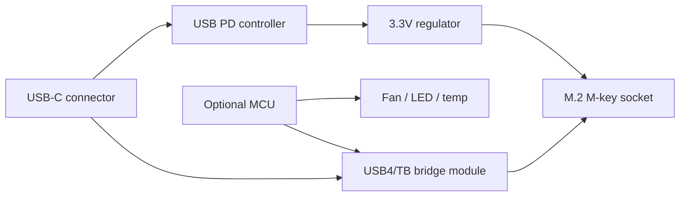

# DIY NVMe External Probe — PCB Concept

Low-cost carrier around an **existing** USB4/Thunderbolt-to-NVMe bridge module — not a custom NVMe ASIC.

## Block diagram



## Subsystems

| Block | Function | Example approach |
|-------|----------|------------------|
| USB-C receptacle | Power + data | USB4 40G footprint |
| PD controller | 5V/9V/15V negotiation | IP2721 / similar |
| 3.3V regulator | NVMe rail (up to ~3A peak) | Buck from PD or 5V |
| Bridge module | PCIe + NVMe to USB4/TB | Off-the-shelf ASM2464/RTL/JHL family **module** |
| M.2 socket | 2280 primary; optional 2242 standoff | PCIe x4, M-key |
| ESD | USB-C CC/SBU/SS lines | USBC-specific array |
| MCU (optional) | Sequencing, fan PWM, USB-CDC status | STM32G0 / RP2040 |
| Sensors (optional) | Enclosure temp, shunt current | I2C |

## Firmware (MCU)

**Scope v1**

- Power-good sequencing delay before PERST# release
- Fan PWM vs enclosure temperature
- Status LED: link, activity, thermal warn
- USB CDC string: board serial, firmware version

**Out of scope v1**

- Implementing NVMe protocol in MCU/FPGA
- Custom PCIe root complex

## PCB layout risks

- USB4/TB differential pairs: controlled impedance, short routes, solid GND reference
- NVMe socket: keep PCIe traces matched length where possible
- Prefer a **certified bridge module** on a daughtercard vs routing full controller silicon on v1

## BOM estimate (hobby, order-of-magnitude)

| Item | Est. USD |
|------|----------|
| Bridge module / reference design board | 25–80 |
| USB-C + PD + passives | 10–20 |
| M.2 socket + mechanical | 5–15 |
| MCU + sensors (optional) | 5–15 |
| 4-layer PCB fab (5 pcs) | 30–80 |
| **Total v1** | **~75–200** |

## Software integration

Once the host OS enumerates the drive as NVMe:

```bash
uv run nvme-sentinel list-devices
uv run nvme-sentinel smart --device <path>
```

Optional future: MCU CDC telemetry endpoint consumed by a separate `board-telemetry` CLI command (not in v1).

## FPGA / custom chip track

Reading NVMe without a standard host requires a **PCIe root complex** + NVMe driver stack (Linux on SoC/FPGA RC). Treat as research-only; see roadmap Phase 6. Not required for NVME Sentinel product validation.
